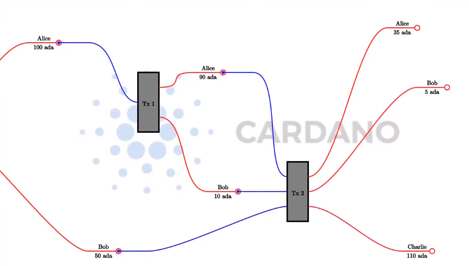

# WEEK-01 Plutus Pioneer Program (3rd cohort)

### (E)UTxO Model

A utxo (as input) has to be consumed entirely, you cannot consume only part of one utxo.
However you can always create an output with the change.

In any particular Tx the sum of the input values must be equal to the sum of the output values.

The exceptions to this rule are tx fees (of course) and the creation (minting) of native tokens in which the outputs will be higher than the inputs or on the contrary the burning of native tokens in which case the inputs will be higher than the outputs.

&sum;inputs = &sum;outputs + <i>Tx Fees</i>

For example, Alice sends 10 ADA to Bob.

Then Alice and Bob send 110 ADA (55 ADA each) to Charlie.

#### Signatures

For a Tx to be able to consume a utxo owned by Alice, Alice needs to sign the tx to approve it (this is done with the signing/private key).

In the case, of the 2nd tx both Alice and Bob need to sign in order for the tx to happen.

[See more (extended UTxO model)](notes/WEEK_01.md) 
