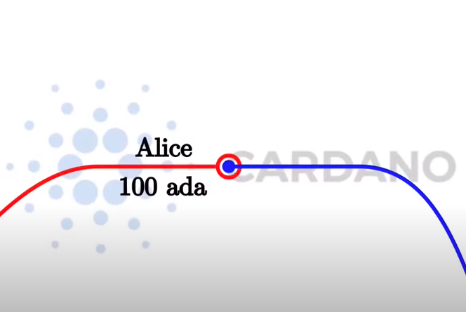
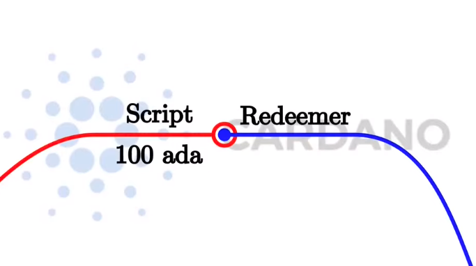
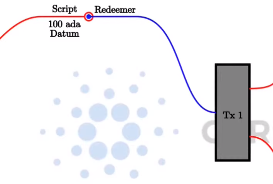

# WEEK 01 PPP 3rd-cohort

## Extended UTxO Model

In the Cardano extended utxo model, apart from the basic behaviour of having a normal user 'public key address' where the utxo is consumed only when the tx is signed by the user (owner of that address), we can also have a 'script address' where the tx is valid only if, given a redeemer as input, the script arbitrary logic approves the tx. So in this case we replace the digital signature of Alice with a Redeemer for the Script.

Basic UTxO Model:

Extended UTxO Model:

Also apart from the Redeemer, the extended model allows for an abritary piece of data called Datum, that can be associated with a specific utxo.

Given this model, Cardano transactions can always be validated before submitting them to the blockchain, so if all of the inputs are still available you can be sure the validated tx won't fail. But if that's not the case, because for example some utxos were consumed at the moment of submitting the tx to the blockchain, then the tx won't happen, and NO fees are charged/consumed either.

In summary, in the extended-uxto-model you can replace a 'public key address' with a 'script address' and instead of needing the signature for consuming a certain uxto, you need a valid redeemer on the input side. You can also have arbitrary custom data called Datum on the output side. And the script can see (have access) to all inputs and outputs of the TX through the 'Script Context'.

### Is important to take into account the following rules:

- The producing Tx (the one that produces outputs that sit at a script address) has to provide only the <b>hash of the Script</b> and the <b>hash of the Datum</b> (optionally can include the actual script and actual datum as well, but is optional).

- While the spending TX (the one that wants to consume the unspent outputs sitting at a script address) has to provide the Script, the Datum, and the Redeemer.

(Unfortunately this means that if you want to consume a utxo sitting at a script address you need to somehow know the Datum, because only the hash is available at the blockchain)