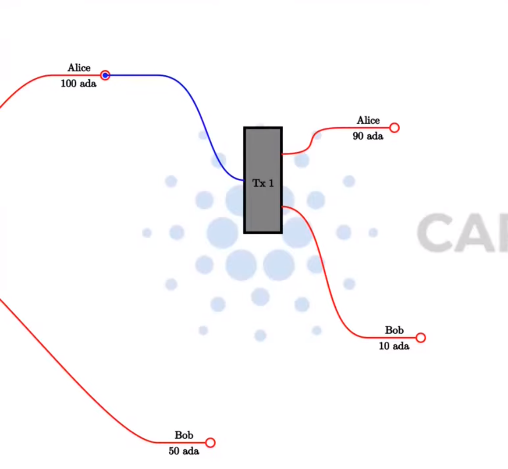

# WEEK 01 PPP 3rd-cohort

### (E)UTxO Model

UtxOs has to be consumed entirely (as inputs) you cannot consume only part of one utxo.
However you can always create an output with the change.

In any particular Tx the sum of the input values must be equal to the sum of the output values.

The exceptions to this rule are tx fees (of course) and the creation (minting) of native tokens in which the outputs will be higher than the inputs or on the contrary the burning of native tokens in which case the inputs will be higher than the outputs.

&sum;inputs = &sum;outputs + <i>Tx Fees</i>

