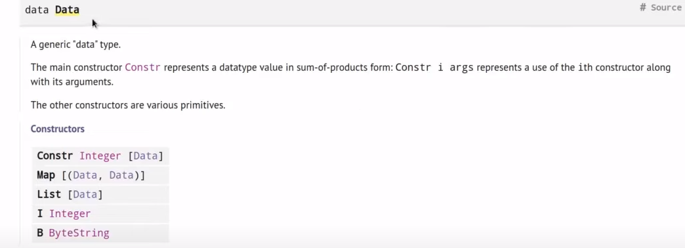

# WEEK-02 Plutus Pioneer Program (3rd cohort)

## On-Chain and Off-Chain code

On-chain code is about validation and 'lives' on the blockchain. Off-chain code is on the user/wallet side and produces transactions/interactions with the script address.

## On-Chain code

### Datum, Redeemer, ScriptContext

### Untyped Validator Scripts

The low-level representation of these 3 pieces of data (in untyped validation scripts) comes from plutus module PlutusTx.TH, and is called <b>BuiltinData</b> (equivalent to datatype <b>Data</b> defined in plutus-core-0.1.0.0:PlutusCore.Data, but only for on-chain code) [See Docs](https://playground.plutus.iohkdev.io/doc/haddock/plutus-tx/html/PlutusTx.html#t:BuiltinData).



So for <b>Untyped Validator Scripts</b> the function signature would be something like this:

```
mkValidator :: BuiltinData ->  BuiltinData -> BuiltinData -> ()
mkValidator datum redeemer context = 
```
where first BuiltinData is the <b>Datum</b>, the second BuiltinData is the <b>Redeemer</b> and the third BuiltinData is the <b>ScriptContext</b>.

The returning type of the mkValidator is () (Unit, similar to void in other languages) and not Bool. That's because if the validator fails, just produces an Error, if the validation passes then the validator doesn't need to return anything (something like Error == false, () == true).

mkValidator is a Haskell functions that needs to be compiled to PlutusCore.

For that we use a template haskell boilerplate that takes something of type ``BuiltinData ->  BuiltinData -> BuiltinData -> ()`` and turns it to 
type ``Validator``.

(*template Haskell is like a Macro that is expanded before the compiler runs)

```
validator :: Validator
validator = mkValidatorScript $$(PlutusTx.compile [|| mkValidator ||])
```

where the oxford brackets ``[|| mkValidator ||]`` takes a haskell expresion, (the source code of mkValidator) and turns it into something of type syntax tree of that expresion and then the splice ``$$`` takes a syntax tree and 'splices' it into source code at that point.

So, \
``mkValidator`` -> is haskell source code, a haskell expresion, \
``[|| mkValidator ||]`` -> is of type haskell code syntax tree, \
``PlutusTx.compile [|| mkValidator ||]`` -> is of type PlutusCore syntax tree, \
and \
``$$(PlutusTx.compile [|| mkValidator ||])`` -> is of type PlutusCore source code, PlutusCore expresion. \
Finally, \
``mkValidatorScript`` takes that PlutusCore expresion and turns it into a ``Validator``.

In order for the oxford brackets ``[|| mkValidator ||]`` to work, mkValidator has to be definded inline, meaning it cannot reference auxiliar functions or expresions from other parts of the code (like libraries, etc). For that reason we need to add the following <i>Pragma</i> to the definition so everything is defined inline:

```
{-# INLINABLE mkValidator #-} <-- add this pragma to make everything defined inline
mkValidator :: BuiltinData -> BuiltinData -> BuiltinData -> ()
mkValidator _ _ _ = ()
```

(also note that all Plutus Prelude functions that are meant to be used for on-chain code should also have this INLINABLE pragma, for the same reason)

We also need to define the validator hash:

```
valHash :: Ledger.ValidatorHash
valHash = Scripts.validatorHash validator
```

and the script address:

```
scrAddress :: Ledger.Address
scrAddress = scriptAddress validator
```

