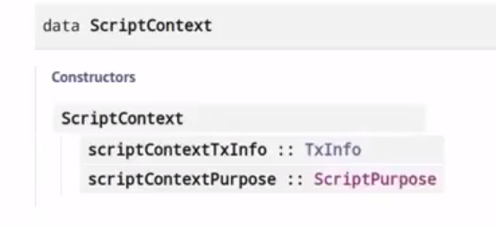
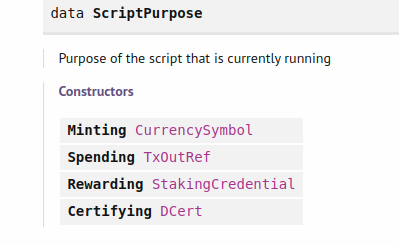
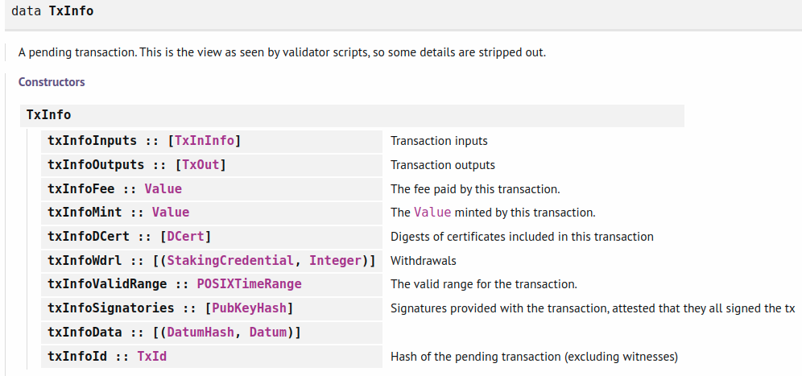

# WEEK-03 Plutus Pioneer Program (3rd cohort)

## Script Context

The ScriptContext type is defined in package plutus-ledger-api, in module Plutus.V1.Ledger.Contexts ([see docs](https://playground.plutus.iohkdev.io/doc/haddock/plutus-ledger-api/html/Plutus-V1-Ledger-Contexts.html))



where the <b>ScriptPurpose</b> can be:



<b>Spending</b> is the most commmon one, and refers to the case where the script is run to validate that we can spend certain inputs in a transaction.    \
<b>Minting</b> is used for defining minting/burning policies for native tokens.  \
<b>Rewarding</b> is related to staking rewards. \
<b>Certifying</b> is used in delegation certificates, etc.

The <b>TXInfo</b> consist of:



## Time Handling

Before even running the validator script, the Cardano Node always checks first that the current time falls into the valid time range provided in the Tx (<b>txInfoValidRange</b> of type POSIXTimeRange). So the time is only a pre-check, that means the validator script itself is deterministic, and the time-check is independent. For this reason, the result of the validation does not depend on when it is run (wheter it is run in the wallet before submission or in one of the nodes when validating a tx). \
This means that, during the execution of a validator script, we don't have to worry about the time-check, and we can asume that the time falls into the valid range (as it was already checked). \
By default, all transactions use the 'infite time range' meaning they are always valid no matter what time they arrive at the node for validation.

POSIXTimeRange

```
typetype POSIXTimeRange = Interval POSIXTime
```

where Interval:

```
Interval	 
ivFrom :: LowerBound a	 
ivTo :: UpperBound a	 
```

and LowerBound:

```
LowerBound (Extended a) Closure	 
```

where Closure is just a Bool to specify if we include the boundary or not and Extended is either:
```
NegInf	 
Finite a	 
PosInf	 
```
(-/+ infinite, or Finite a)

Useful functions:

```
member :: Ord a => a -> Interval a -> Bool
(checks if a given time is included in the interval)

interval :: a -> a -> Interval a
(returns a interval with the two parameters as included upper/lower boundaries)

from :: a -> Interval a
(interval from parameter to eternity)

to :: a -> Interval a
(interval from genesis to parameter)
```


