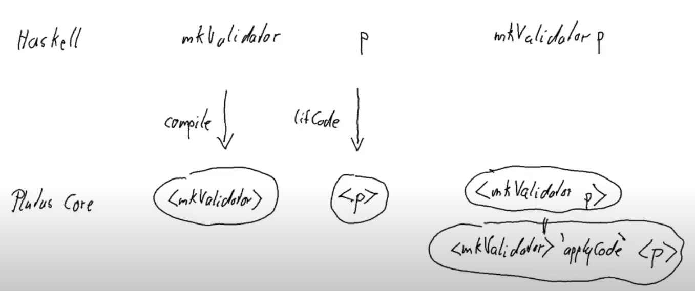

# WEEK 03 PPP 3rd-cohort

## Parameterized Vesting Example

Instead of having a fixed/constant script, that is defined at build time, we can parameterize it, and in this way define a "family" of scripts so to speak. Because now the final script we get will be defined by the parameters we use.

Following with the same "vesting" example, we now defined the inputs as 'VestingParam' and they are no longer part of the Datum:


```haskell
data VestingParam = VestingParam
    { beneficiary :: PaymentPubKeyHash
    , deadline    :: POSIXTime
    } deriving Show
```

So in this case, <b>mkValidator</b> receives an extra argument, which are the params, and we keep the Datum as simply Unit (cause all the values we need are in the params now, so no need for any Datum):

```haskell
{-# INLINABLE mkValidator #-}
mkValidator :: VestingParam -> () -> () -> ScriptContext -> Bool
mkValidator p () () ctx = traceIfFalse "beneficiary's signature missing" signedByBeneficiary &&
                          traceIfFalse "deadline not reached" deadlineReached
  where
    info :: TxInfo
    info = scriptContextTxInfo ctx

    signedByBeneficiary :: Bool
    signedByBeneficiary = txSignedBy info $ unPaymentPubKeyHash $ beneficiary p

    deadlineReached :: Bool
    deadlineReached = contains (from $ deadline p) $ txInfoValidRange info
```

The logic inside the validator keeps the same, only change is now we don't need to read the Datum, we get the values from the params.  \
And the boilerplate for 'compiling' the script to Plutus changes just a little bit, cause now we have to receive an argument which in this case is VestingParam:

```haskell
data Vesting
instance Scripts.ValidatorTypes Vesting where
    type instance DatumType Vesting = ()
    type instance RedeemerType Vesting = ()

typedValidator :: VestingParam -> Scripts.TypedValidator Vesting
typedValidator p = Scripts.mkTypedValidator @Vesting
    ($$(PlutusTx.compile [|| mkValidator ||]) `PlutusTx.applyCode` PlutusTx.liftCode p)
    $$(PlutusTx.compile [|| wrap ||])
  where
    wrap = Scripts.wrapValidator @() @()
```

(Note that everything inside `[|| oxford brackets ||]` needs to be known at compile time, so we cannot just do `[|| mkValidator p ||]`, cause we don't know 'p' at compile time. For that reason we need to use `PlutusTx.liftCode p` and then `applyCode` to the compiled version of `mkValidator`, see image below)




Here we just use function composition:

```haskell
validator :: VestingParam -> Validator
validator = Scripts.validatorScript . typedValidator
```

so we actually have:
```haskell
validator p = Scripts.validatorScript $ typedValidator p
```
but we can turn it to just:
```haskell
validator = Scripts.validatorScript . typedValidator
```

The same for the other two:

```haskell
valHash :: VestingParam -> Ledger.ValidatorHash
valHash = Scripts.validatorHash . typedValidator

scrAddress :: VestingParam -> Ledger.Address
scrAddress = scriptAddress . validator
```