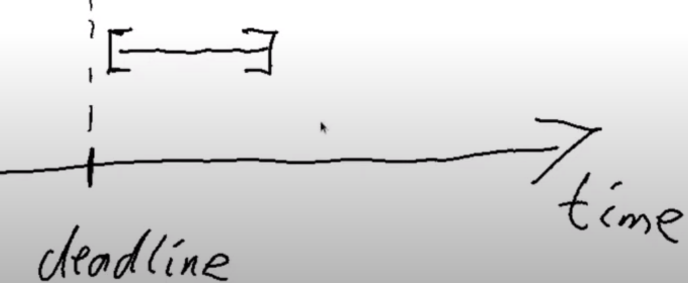

# WEEK 03 PPP 3rd-cohort

## Vesting example (using ScriptContext)


In this example the validator script receives a PaymentPubKeyHash (payment public key hash) and a POSIXTime as Datum. The PubKeyHash is indicating the beneficiary (the person that has permissions to withdraw the funds) and the POSIXTime is the deadline (in this case is indicating that the beneficiary can only withdraw AFTER the deadline is reached).

```
data VestingDatum = VestingDatum
    { beneficiary :: PaymentPubKeyHash
    , deadline    :: POSIXTime
    } deriving Show

PlutusTx.unstableMakeIsData ''VestingDatum

{-# INLINABLE mkValidator #-}
mkValidator :: VestingDatum -> () -> ScriptContext -> Bool
mkValidator dat () ctx = traceIfFalse "beneficiary's signature missing" signedByBeneficiary &&
                         traceIfFalse "deadline not reached" deadlineReached
  where
    info :: TxInfo
    info = scriptContextTxInfo ctx

    signedByBeneficiary :: Bool
    signedByBeneficiary = txSignedBy info $ unPaymentPubKeyHash $ beneficiary dat

    deadlineReached :: Bool
    deadlineReached = contains (from $ deadline dat) $ txInfoValidRange info
```

As you can see, we use two helper functions (signedByBeneficiary and deadlineReached) to check both conditions for a withdraw, and in both of those functions we need the TXInfo field from the ScriptContext. 

For checking who signed the Tx we can use the already defined 'txSignedBy' that receives a TXInfo and a PubKeyHash and returns true if the Tx was signed by the owner of the PubKeyHash. We have to 'unwrap' it with unPaymentPubKeyHash to turn PaymentPubKeyHash into simply PubKeyHash (although the underlying type is the same, PaymentPubKeyHash is just a wrapper to PubKeyHash to be able to make a distinction).

```
type PaymentPubKeyHash :: *
newtype PaymentPubKeyHash = PaymentPubKeyHash {unPaymentPubKeyHash :: PubKeyHash}
-- Defined in ‘Ledger.Address’
```

To check the deadline was reached we can just ask if the txInfoValidRange is contained in the interval from deadline to infinity (from $ deadline dat), that means the Tx is happening anytime after the deadline (cause deadline is the lowerBound of the interval that contains it).





### Off-Chain code

We define GiveParams with the params we need to make a give action, being those: the beneficiary, the deadline and the amount we want to send to the script address.

```
data GiveParams = GiveParams
    { gpBeneficiary :: !PaymentPubKeyHash
    , gpDeadline    :: !POSIXTime
    , gpAmount      :: !Integer
    } deriving (Generic, ToJSON, FromJSON, ToSchema)

type VestingSchema =
            Endpoint "give" GiveParams
        .\/ Endpoint "grab" ()

give :: AsContractError e => GiveParams -> Contract w s e ()
give gp = do
    let dat = VestingDatum
                { beneficiary = gpBeneficiary gp
                , deadline    = gpDeadline gp
                }
        tx  = Constraints.mustPayToTheScript dat $ Ada.lovelaceValueOf $ gpAmount gp
    ledgerTx <- submitTxConstraints typedValidator tx
    void $ awaitTxConfirmed $ getCardanoTxId ledgerTx
    logInfo @String $ printf "made a gift of %d lovelace to %s with deadline %s"
        (gpAmount gp)
        (show $ gpBeneficiary gp)
        (show $ gpDeadline gp)
```

As you can see, the give endpoint just receives the params and creates a Tx with a utxo at the script-address, with the corresponding datum and amount of lovelace. Submits, awaits confirmation and logs a message.

On the other hand, the grab endpoint doesn't need any params:

```
grab :: forall w s e. AsContractError e => Contract w s e ()
grab = do
    now   <- currentTime
    pkh   <- ownPaymentPubKeyHash
    utxos <- Map.filter (isSuitable pkh now) <$> utxosAt scrAddress
    if Map.null utxos
        then logInfo @String $ "no gifts available"
        else do
            let orefs   = fst <$> Map.toList utxos
                lookups = Constraints.unspentOutputs utxos  <>
                          Constraints.otherScript validator
                tx :: TxConstraints Void Void
                tx      = mconcat [Constraints.mustSpendScriptOutput oref unitRedeemer | oref <- orefs] <>
                          Constraints.mustValidateIn (from now)
            ledgerTx <- submitTxConstraintsWith @Void lookups tx
            void $ awaitTxConfirmed $ getCardanoTxId ledgerTx
            logInfo @String $ "collected gifts"
```

As it is possible that there are many utxos sitting at the script-address, in the grab action we can just filter by suitable utxos, meaning that they have the correct beneficiary and the deadline is reached. \
For this purpose, we get the currentTime and our own PaymentPubKeyHash, and we filter utxos with the 'isSuitable' helper function. 

If there are no suitable utxos we just log "no gifts available", but if there are suitable utxos we try to collect them all in one Tx (of course in the real world this is not always possible because Txs are limited in size and we need to check first if there are too many uxtos, and in that case we could need more than one tx).

To build the TX, we collect the orefs of the utxos, we build the lookups with the uxtos and the validator-script itself. We build the tx saying that we want to spend each of the orefs (coming from the suitable utxos) and proving just a 'unitRedeemer' (as we don't need any particular redeemer). We also provide a valid time interval for the tx that is anytime after the current time (Constraints.mustValidateIn (from now)). \
Then we submit tx, await for confirmation, and log a message.

### isSuitable

```
where
    isSuitable :: PaymentPubKeyHash -> POSIXTime -> ChainIndexTxOut -> Bool
    isSuitable pkh now o = case _ciTxOutDatum o of
        Left _          -> False
        Right (Datum e) -> case PlutusTx.fromBuiltinData e of
            Nothing -> False
            Just d  -> beneficiary d == pkh && deadline d <= now
```

IsSuitable takes the pkh and the currentTime and has to consider 2 cases: the case when the utxo has only the DatumHash and not the actual Datum itself (in which case we cannot do anything as we cannot guess the Datum), and the case where the utxo provides the actual Datum in addition to the DatumHash. \
In the case that we count with the Datum, we try to de-serialize it to the correct datatype (VestingDatum) and if it fails we also drop the utxo. But if it succeeds, we check that we are the beneficiary and that the deadline is in the past (deadline <= now).
